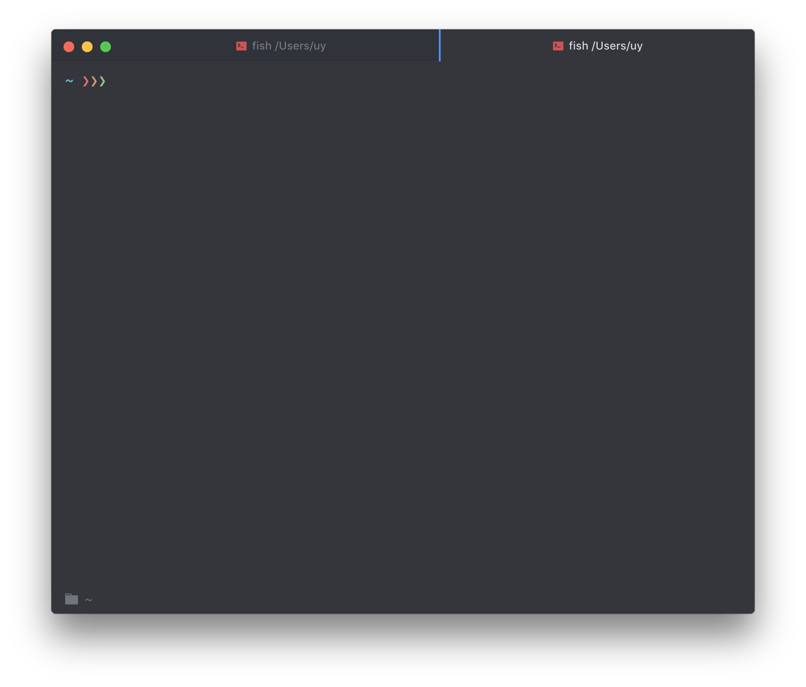
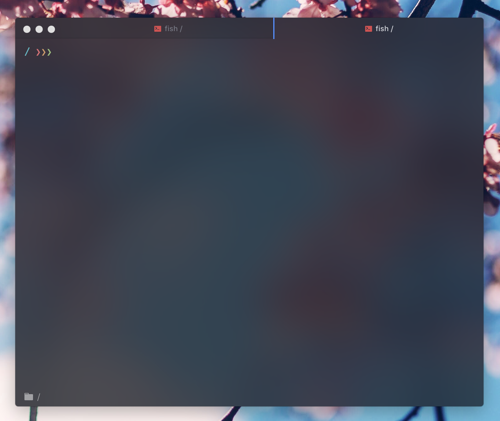

# Atom One Dark Vibrancy for Hyper

[Hyper](https://hyper.is) theme based on [the Atom One Dark theme](https://github.com/atom/one-dark-syntax). Forked from @jxnblk's [HyperTerminator](https://github.com/jxnblk/hyperterminator) and modified by @mdo.




### Install

1. Open Hyper's preferences with `Cmd+,` (or manually at `~/.hyper.js`) with your editor.
2. Update your list of plugins to include `hyperterm-atom-dark`, like so:
  
  ```js
plugins: [
  'hyper-atom-dark-vibrancy'
],
```
3. Fully reload Hyper (`Cmd+Shift+R`), and tada!

Add follows line to config for enable the light vibrancy effect:

```js
enableVibrancy: true
```

### License

MIT
